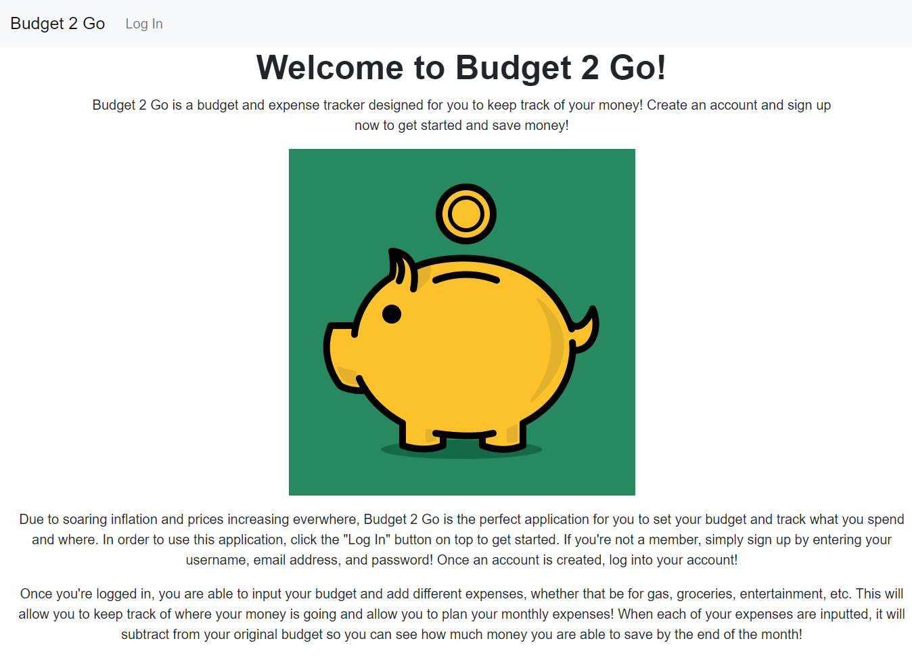
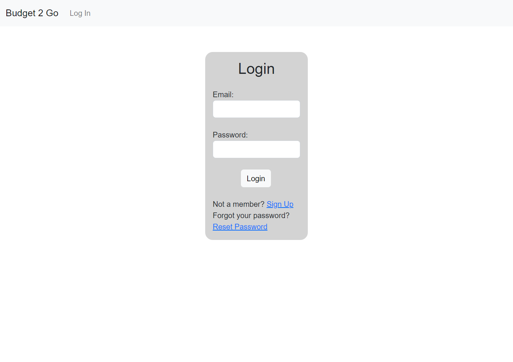
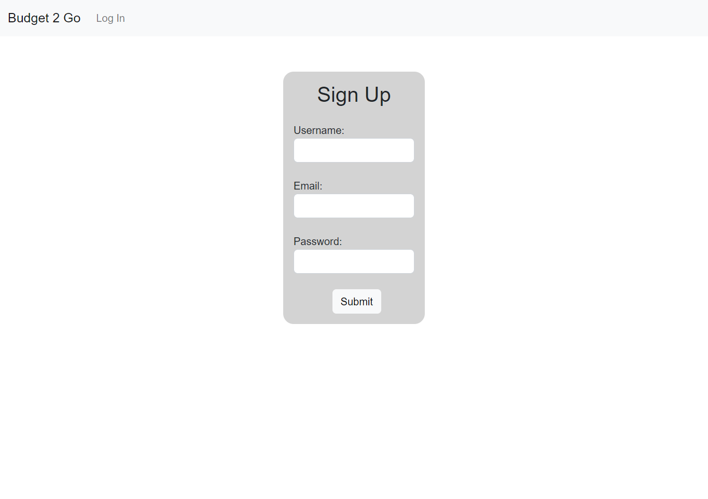
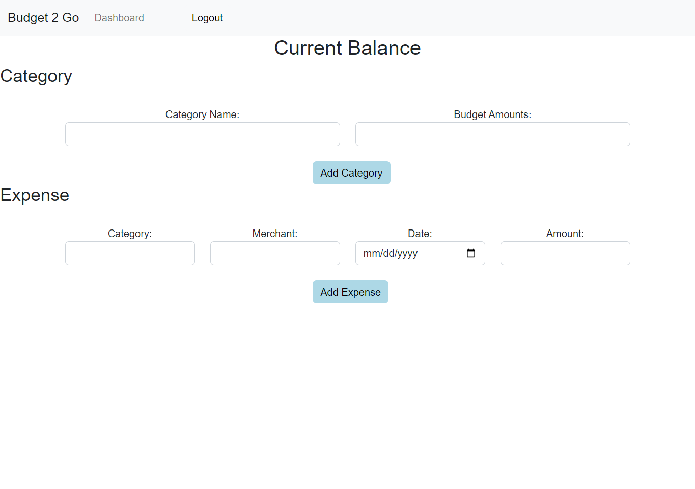

# Budget 2 Go

## Description
Want to save money? Want to see where your money is going? Come and use Budget 2 Go! Budget 2 Go is an easy-to-use application that allows any user to track their expenses by adding their budget. Simply create an account and join the Budget 2 Go family!

## Technologies Used
- Bootstrap CSS
- Sequelize
- MySQL12
- Express
- Dotenv
- Bcrypt
- Randomstring
- Nodemailer

## Team Members
- [Alan Huang](https://github.com/ahuang23)
- [Lydia Kim](https://github.com/lydiakim10)
- [Grace Shim](https://github.com/GraceShim)
- [Dylan Yamashiro](https://github.com/dylster1995)

## Link to Website
https://evening-meadow-72546.herokuapp.com/

## Presentation Slide
https://docs.google.com/presentation/d/1y1NrJkVIXtyFaC_dk-4VDVptpF6-tID3KEnfB4JRg-g/edit?usp=sharing

## Website Screenshots
### Homepage

### Login

### Signup

### Dashboard
